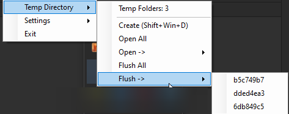

# SlickDirectory

SlickDirectory empowers the clipboard and temporary scrach/work directories for a faster work with files in Windows.

## Features

- Create a temporary directory that deletes on shutdown/restart.
    - Clipboard extraction allowing for fast:
      1. Convert any image from clipboard/url/file to png
         - Supporting WEBP (never deal with this devil again)
         - Supporting ICO
         - Supporting Discord Image copy to clipboard.
      2. Download url/s from clipboard.
      3. Copy files
         1. Large files are hard-linked (configurable)
      2. Files with json content are automatically formatted (into a separate copy).
  - The app remembers created directories, allowing you to open them again, flush and so on.
  - On unexpected shutdown of the app, on the next launch the app will remember and reopen the directories that were not deleted. 
- Register to startup.
